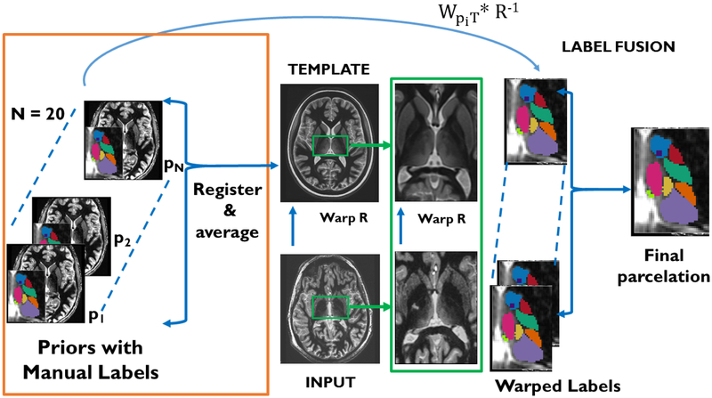

# THOMAS docker version
This is a docker container for Thalamus Optimized Multi Atlas Segmentation (THOMAS), the state of the art multi-atlas thalamic nuclei segmentation method.
The THOMAS workflow is shown below-



## Installation instructions
- Download the files using ```git clone https://github.com/thalamicseg/thomasdocker.git``` which will create a thomasdocker directory

- Make sure docker is installed already on your machine or install it from here https://docs.docker.com/get-docker/.  
- Run ```docker build -t thomas .``` inside the thomasdocker directory after the download in step 1 to create a container named thomas. Note the period at the end of the command which is critical.

- The container is 41Gb so make sure the disk/partition you are installing it in has enough space. During buildtime, it might need more for temporary files so use 100G to be safe. The required programs for THOMAS including ANTs (2.3.4), FSL (5.0), c3d and THOMAS pulled from github will be downloaded which are long. So please be patient !

- When the build finishes, type ```docker images``` to see thomas listed as a repository. If you see it, you are good to go !

## Script usage
- THOMAS is installed in the container in /opt/thomas_new and comes with three wrapper scripts.
- White matter nulled MPRAGE: Use the ```thomas_csh``` wrapper provided for WMn MPRAGE data (or ```thomas_csh_big``` for handling large ventricles such as in older subjects)
  
  Usage: ```thomas_csh WMnMPRAGEfile <ro/lo>```  or ```thomas_csh_big WMnMPRAGEfile <ro/lo> ```

  **Note 1**: the first argument is the white matter nulled MPRAGE file in NIFTy nii.gz format. Make sure it is just the file name and not a full path (e.g. wmn.nii.gz not ~foo/data/case1/wmn.nii.gz. Basically, run the script in the directory where the file is located. If you have each subject in a directory, go to each directory and call the thomas_csh script, usually from a simple csh or bash script
  
  **Note 2**: the second argument, if set to ro/lo, would only segment the right/left side (if missing, it defaults to both left and right)
- Standard T1 or MPRAGE: Use the ```thomas_csh_mv``` wrapper provided for standard MPRAGE or T1 (FSPGR or BRAVO in older GE) data

  Usage: ```thomas_csh_mv MPRAGE/T1file <ro/lo>``` 
  
## Docker usage
- There are multiple ways to use the container. You can launch a container and mount the folder with your data inside the container and then run it manually or a script inside the container. You can also directly run it from the command line by launching the container with a bash command.
- Method 1. Launch the container using ```docker run -v <yourdatadir>:<yourdatadir> -w <yourdatadir>  --rm -it thomas ``` and then run the thomas_csh or thomas_csh_mv on the files you want. Each file has to be in a separate folder and you can simply write a script to go into each one and run the script. The -v argument mounts your data directory inside the container.
- Method 2. Launch the container using ```docker run -v ${PWD}:${PWD} -w ${PWD} --rm -t thomas bash -c "thomas_csh_mv T1filename" ``` to directly run thomas_csh_mv on the T1filename located in the current directory. Note that you will have to have each input file in a different directory and write a script to go into each directory and execute the above command to process them all. The -v argument mounts your data directory inside the container.

## Ownership/Permissions
- After you run inside the docker, the files created will be owned by root, which can be annoying if you want to delete them and do not have sudo. To avoid this you can, add ```--user $(id -u):$(id -g) ``` to your docker commands to preserve the ownership. This, in some machines, will generate a bizarre prompt due to usernames missing but after it finishes, it will retain your ownership of the files THOMAS creates.

## Outputs
The directories named left and right contain the outputs which are individual nuclei labels (e.g. 2-AV.nii.gz for anteroventral and so on), ```thomas.nii.gz``` which is a single file with all labels fused, and ```thomasfull.nii.gz``` which is the same size as the input file (i.e. full size as opposed to thomas which is cropped). In addition, ```nucVols.txt``` contains the nuclei volumes and ```regn.nii.gz``` is the custom template registered to the input image. This file is critical for debugging. Make sure this file and crop_<inputfilename> are well aligned. A color table file called CustomAtlas.ctbl is provided for visualization.

## Thalamic nuclei expansions and label definitions
THOMAS outputs the mammillothalamic tract (14-MTT) and the eleven delineated nuclei grouped as follows (__Note that 6-VLP is further split into 6_VLPv and 6_VLPd. 6_VLPv is the same as VIM used for targeting in DBS applications__)-

	(a) medial group: habenula (13-Hb), mediodorsal (12-MD), centromedian (11-CM) 
	(b) posterior group: medial geniculate nucleus (10-MGN), lateral geniculate nucleus (9-LGN),  pulvinar (8-Pul),
	(c) lateral group: ventral posterolateral (7-VPL), ventral lateral posterior (6-VLp), ventral lateral anterior (5-VLa), ventral anterior nucleus (4-VA)
	(d) anterior group: anteroventral (2-AV)


## Citation
The neuroimage paper on THOMAS can be found here https://pubmed.ncbi.nlm.nih.gov/30894331/

	Su J, Thomas FT, Kasoff WS, Tourdias T, Choi EY, Rutt BK, Saranathan M. Thalamus Optimized Multi-atlas Segmentation (THOMAS):
	fast, fully automated segmentation of thalamic nuclei from anatomical MRI. NeuroImage; 194:272-282 (2019)

## Contact
Please contact Manoj Saranathan manojsar@email.arizona.edu in case you have any questions or difficulties in installation/running. 

